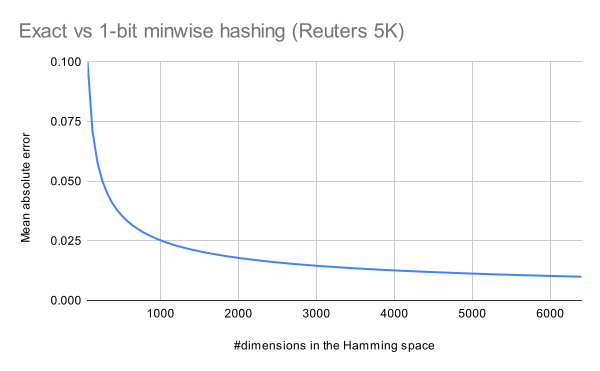
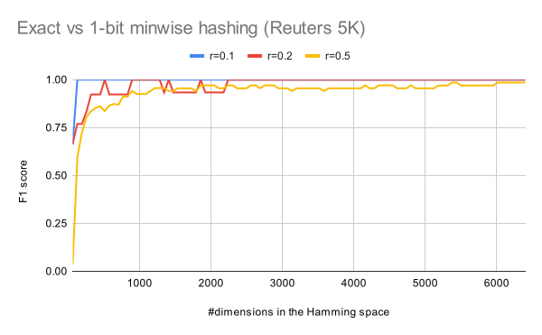

# Finding all-pair similar documents


This software provides time- and memory-efficient all-pair similarity searches in documents.

## Problem definition

- Input
  - List of documents $D = (d_1, d_2, \dots, d_n)$
  - Distance function $\delta: D \times D \rightarrow [0,1]$
  - Radius threshold $r \in [0,1]$
- Output
  - All pairs of similar document ids $R = \\{ (i,j): i < j, \delta(d_i, d_j) \leq r \\}$

## Features

- **Easy to use:** This software supports all essential steps of document similarity search,
from feature extraction to output of similar pairs.
Therefore, you can immediately try the fast all-pair similarity search using your document files.
- **Flexible tokenization:** You can specify any delimiter when splitting words in tokenization for feature extraction.
This can be useful in languages where multiple definitions of words exist, such as Japanese or Chinese.
- **Time and memory efficiency:** The time and memory complexities are *linear* over the numbers of input documents and output results
on the basis of the ideas behind the locality sensitive hashing (LSH) and [sketch sorting approach](https://proceedings.mlr.press/v13/tabei10a.html).
- **Flexible search performance:** LSH allows tuning of performance in accuracy, time, and memory, through a manual parameter specifying search dimensions.
You can flexibly perform searches depending on your dataset and machine environment.
  - Specifying lower dimensions allows for faster and rougher searches for similar documents with less memory usage.
  - Specifying higher dimensions allows for more accurate searches for similar documents with more memory usage.
- **Pure Rust:** This software is implemented in Rust, achieving safe and fast performance.

## Running example

Here, we describe the basic usage of this software through an example of running the CLI tool.

First of all, install `rustc` and `cargo` following the [official instructions](https://www.rust-lang.org/tools/install) since this software is implemented in Rust.

### 1. Data preparation

You have to prepare a text file containing documents line by line (NOT including empty lines).

To produce an example file used throughout this description, you can use `scripts/load_nltk_dataset.py` that downloads the Reuters Corpus provided by NLTK.
Run the following command.

```
$ ./scripts/load_nltk_dataset.py reuters
```

`reuters.txt` will be output.

```
$ head reuters.txt
hre properties & lt ; hre > 1st qtr jan 31 net shr 38 cts vs 47 cts net 2 , 253 , 664 vs 2 , 806 , 820 gross income 5 , 173 , 318 vs 5 , 873 , 904 note : net includes gains on sale of real estate of 126 , 117 dlrs vs 29 , 812 dlrs .
the firm , however , is supplying temporary financing , and sources close to the transaction disputed the claim that the firm will not end up paying for its equity position . 
conoco , which has completed geological prospecting for the tunisian government , has transferred one third of its option rights in the region to ina , it said .
" willis faber ' s stake in morgan grenfell has been a very successful investment ," it said .
china reports 700 mln dlr two - month trade deficit china ' s trade deficit totalled 700 mln dlrs in the first two months of this year , according to figures released by the state statistics bureau .
the treasury said baker and stoltenberg " are consulting with their g - 7 colleagues and are confident that this will enable them to foster exchange rate stability around current levels ."
u . s . tariffs are due to take effect on april 17 .
some dealers said there were growing signs the united states wanted the dollar to fall further .
since last august smart has been leading talks to open up japan to purchases of more u . s .- made automotive parts .
the resulting association will operate under the name of charter and will be based in bristol .
```

Fully-duplicate documents in `reuters.txt` are removed because they are noisy in evaluation of similarity searches.
To do this, the output lines are shuffled, and your file will not be the identical to the example.

### 2. Finding all pairs of similar documents

The workspace `find-simdoc-cli` provides CLI tools for fast all-pair similarity searches in documents.
The approach consists of three steps:

1. Extract features from documents
   - Set representation of character or word ngrams
   - Tfidf-weighted vector representation of character or word ngrams
2. Convert the features into binary sketches through locality sensitive hashing (LSH)
   - [1-bit minwise hashing](https://dl.acm.org/doi/abs/10.1145/1772690.1772759) for the Jaccard similarity
   - [Simplified simhash](https://dl.acm.org/doi/10.1145/1242572.1242592) for the Cosine similarity
3. Search for similar sketches in the Hamming space using a modified variant of the [sketch sorting approach](https://proceedings.mlr.press/v13/tabei10a.html)

#### 2.1 Jaccard space

The executable `jaccard` provides a similarity search in the [Jaccard space](https://en.wikipedia.org/wiki/Jaccard_index).
You can check the arguments with the following command.

```
$ cargo run --release -p find-simdoc-cli --bin jaccard -- --help
```

Run the following command if you want to search for `reuters.txt` with

- search radius `0.1`,
- tokens of character `5`-grams, and
- `15*64=960` dimensions in the Hamming space.

```
$ cargo run --release -p find-simdoc-cli --bin jaccard -- -i reuters.txt -r 0.1 -w 5 -c 15 > result-jaccard.csv
```

Argument `-c` indicates the number of dimensions in the Hamming space,
a trade-off parameter between approximation accuracy and search speed.
The larger this value, the higher the accuracy, but the longer the search takes.
[This section](#4-testing-the-accuracy-of-1-bit-minwise-hashing) describes how to examine the approximation accuracy for the number of dimensions.

Pairs of similar documents (indicated by zero-origin line numbers) and their distances are reported.

```
$ head result-jaccard.csv
i,j,dist
191,29637,0.07291666666666667
199,38690,0.0375
274,10048,0.07083333333333333
294,27675,0.04791666666666667
311,13812,0.04583333333333333
361,50938,0.08958333333333333
469,6360,0.035416666666666666
546,10804,0.0875
690,28281,0.0875
```

#### 2.2 Cosine space

The executable `cosine` provides a similarity search in the [Cosine space](https://en.wikipedia.org/wiki/Cosine_similarity).
You can check the arguments with the following command.

```
$ cargo run --release -p find-simdoc-cli --bin cosine -- --help
```

Run the following command if you want to search for `reuters.txt` with

- search radius `0.1`,
- tokens of word `3`-grams,
- word delimiter `" "` (i.e., a space),
- `10*64=640` dimensions in the Hamming space, and
- weighting using the standard TF and the smoothed IDF.

```
$ cargo run --release -p find-simdoc-cli --bin cosine -- -i reuters.txt -r 0.1 -d " " -w 3 -c 10 -T standard -I smooth > result-cosine.csv
```

Pairs of similar documents (indicated by zero-origin line numbers) and their distances are reported.

```
$ head result-cosine.csv
i,j,dist
542,49001,0.084375
964,24198,0.09375
1872,3024,0.0859375
1872,6823,0.090625
1872,8462,0.0953125
1872,11402,0.090625
1872,18511,0.0859375
1872,41491,0.0875
1872,48344,0.0859375
```

### 3. Printing similar documents

The executable `dump` prints similar documents from an output CSV file.

If you want to print similar documents in `reuters.txt` with the result `result-jaccard.csv`,
run the following command.

```
$ cargo run --release -p find-simdoc-cli --bin dump -- -i reuters.txt -s result-jaccard.csv
[i=191,j=29637,dist=0.07291666666666667]
pending its deliberations , harper and row ' s board has postponed indefinitely a special meeting of stockholders that had been scheduled for april 2 to discuss a proposal to recapitalize the company ' s stock to create two classes of shares with different voting rights .
pending its deliberations , harper and row ' s board has postponed indefinitely a special meeting of stockholders that had been scheduled for april 2 to discuss a proposal to recapitalize the company ' s stock in order to create two classes of shares with different votinmg rights .
[i=199,j=38690,dist=0.0375]
government officials had no immediate comment on the report , which advised a reduction in the overall size of the public investment programme and greater emphasis on the preservation of peru ' s export potential .
government officials had no immediate comment on the report , which advised a reduction in the overall size of the public investment program and greater emphasis on the preservation of peru ' s export potential .
[i=274,j=10048,dist=0.07083333333333333]
the measure was adopted as part of a wide - ranging trade bill that will be considered by the full house in april before it moves on to the senate .
the measure was adopted as part of a wide - ranging trade bill that will be considered by the full house in april before it moves onto the senate .
[i=294,j=27675,dist=0.04791666666666667]
the company said the start - up was necessitated by continuing strong demand for aluminum and dwindling worldwide inventories , and that the metal is needed to supply reynolds ' various fabricating businesses .
the company said the start up was necessitated by continuing strong demand for aluminum and dwindling worldwide inventories , and that the metal is needed to supply reynolds ' various fabricating businesses .
[i=311,j=13812,dist=0.04583333333333333]
he said in an interview with reuter that after a few years it was likely south korea would drop barriers to foreign goods and move toward a more balanced trade position .
he said in an interview with reuters that after a few years it was likely south korea would drop barriers to foreign goods and move toward a more balanced trade position .
[i=361,j=50938,dist=0.08958333333333333]
hog and cattle slaughter guesstimates chicago mercantile exchange floor traders and commission house representatives are guesstimating today ' s hog slaughter at about 295 , 000 to 305 , 000 head versus 307 , 000 week ago and 311 , 000 a year ago .
hog and cattle slaughter guesstimates chicago mercantile exchange floor traders and commission house representatives are guesstimating today ' s hog slaughter at about 295 , 000 to 308 , 000 head versus 305 , 000 week ago and 308 , 000 a year ago .
[i=469,j=6360,dist=0.035416666666666666]
the national planning department forecast that in 1987 coffee , colombia ' s traditional major export , will account for only one - third of total exports , or about 1 . 5 billion dlrs .
the national planning department forecast that in 1987 coffee , colombia ' s traditional major export , will account for only one third of total exports , or about 1 . 5 billion dlrs .
...
```

### 4. Testing the accuracy of 1-bit minwise hashing

LSH is an approximate solution, and you may want to know the accuracy.
The executable `minhash_acc` allows you to examine
- the mean absolute error that is the averaged gap between the normalized Hamming distance and the actual Jaccard distance,
- the precisions for search radii {0.1, 0.2, 0.5},
- the recalls for search radii {0.1, 0.2, 0.5}, and
- the F1-scores for search radii {0.1, 0.2, 0.5}.

To use this executable, we recommend extracting a small subset from your dataset
because it exactly computes distances for all possible pairs and maintains a large amount of data in main memory.

```
$ head -5000 reuters.txt > reuters.5k.txt
```

You can test the number of Hamming dimensions from 64 to 6400
(i.e., the number of chunks from 1 to 100 indicated with `-c`)
with the following command.
The arguments for feature extraction are the same as those of `jaccard`.

```
$ cargo run --release -p find-simdoc-cli --bin minhash_acc -- -i reuters.5k.txt -w 5 > acc.csv
```

The statistics will be reported as follows.
It can be seen that the accuracy improves as the number of dimensions increases.

```
$ cat acc.csv
num_chunks,dimensions,mean_absolute_error,precision_0.1,recall_0.1,f1_0.1,precision_0.2,recall_0.2,f1_0.2,precision_0.5,recall_0.5,f1_0.5
1,64,0.09996782775866102,0.5,1,0.6666666666666666,0.8,0.5714285714285714,0.6666666666666666,0.02139917695473251,0.7647058823529411,0.04163330664531626
2,128,0.07069611162104494,1,1,1,0.8333333333333334,0.7142857142857143,0.7692307692307692,0.47368421052631576,0.7941176470588235,0.5934065934065933
3,192,0.05776715360376704,1,1,1,0.8333333333333334,0.7142857142857143,0.7692307692307692,0.6304347826086957,0.8529411764705882,0.725
4,256,0.049919892543492474,1,1,1,1,0.7142857142857143,0.8333333333333333,0.8181818181818182,0.7941176470588235,0.8059701492537314
...
97,6208,0.0101065034709229,1,1,1,1,1,1,1,0.9705882352941176,0.9850746268656716
98,6272,0.010056169962171922,1,1,1,1,1,1,1,0.9705882352941176,0.9850746268656716
99,6336,0.01000512597491915,1,1,1,1,1,1,1,0.9705882352941176,0.9850746268656716
100,6400,0.00995601577231552,1,1,1,1,1,1,1,0.9705882352941176,0.9850746268656716
```

## Approximation accuracy of 1-bit minwise hashing

LSH is an approximation solution, and the number of dimensions in the Hamming space
(indicated with the command line argument `-c`) is related to the approximation accuracy.
As a hint for choosing a parameter of `-c`, we show the experimental results obtained in the above running example with `minhash_acc`.

### Mean absolute error (MAE)

The following figure shows MAEs while varying the number of Hamming dimensions from 64 to 6400 (i.e., the number of chunks from 1 to 100 indicated with `-c`).



As expected, the larger the number, the higher the accuracy. For example, when the number of dimensions is 1024 (setting the argument `-c 16`), we achieve the MAE around 2.5%.

### F1 score

The following figure shows F1 scores in search with radii 0.1, 0.2, and 0.5 (indicated with the argument `-r`).



For a small radius `-r 0.1`, few dimensions are enough to obtain high F1 scores.
Setting at least `-c 2` achieves the perfect F1 score.
For larger radii, when the number of dimensions is 1024 (setting `-c 16`),
we achieve the score around 90%.

## Disclaimer

This software is developed by LegalForce, Inc.,
but not an officially supported LegalForce product.

## License

Licensed under either of

 * Apache License, Version 2.0
   ([LICENSE-APACHE](LICENSE-APACHE) or http://www.apache.org/licenses/LICENSE-2.0)
 * MIT license
   ([LICENSE-MIT](LICENSE-MIT) or http://opensource.org/licenses/MIT)

at your option.

## Contribution

Unless you explicitly state otherwise, any contribution intentionally submitted
for inclusion in the work by you, as defined in the Apache-2.0 license, shall be
dual licensed as above, without any additional terms or conditions.

## TODO

- Publish APIs in crate.io.
